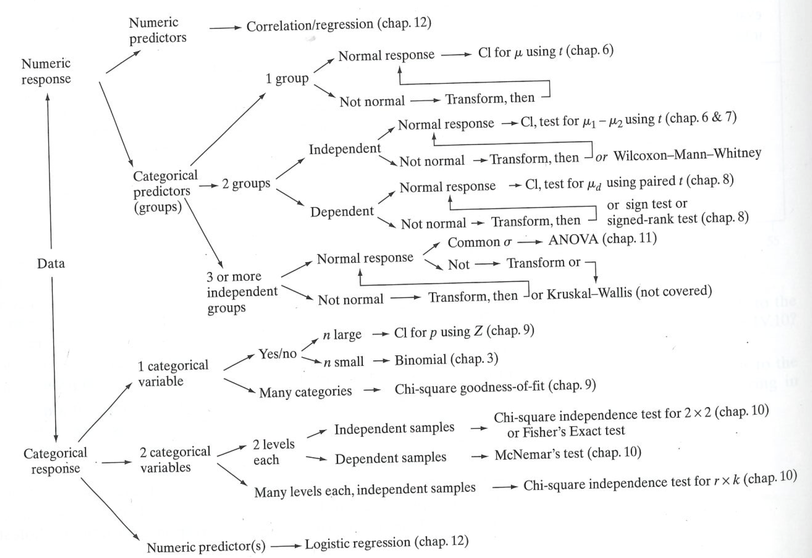

# R stats cheatsheet

## Summary statistics and general math
- `mean(x)`: calculate the mean of a vector `x`
    - `mean(c(1,2,3,4,5))`
    - `mean(c(1,2,3,4,NA), na.rm = T)`: make sure to use `na.rm = T` if your sample has NA values
- `sd(x)`: calculate the standard deviation of a vector `x`
    - `sd(c(1,2,3,4,5))`
- `summary(x)`: calculate six number summary statistics of a vector `x` (min, q1, median, mean, q3, max)
    - `summary(c(1,2,3,4,5))`
- `table(x)`: counts the number of unique values of x
    - `table(ice_cream$ice_cream)` returns the number of students that like each of the three flavors of ice cream
- `sum(x)`: calculate sum of vector `x`
    - `sum(c(1,2,3,4,5))`
- `prod(x)`: calculate product of vector `x`
    - `prod(c(4,5,2))`
- `sqrt(x)`: calculate the sqare root of a value
    - `sqrt(100)`

## Sampling from a distribution
- `seq(from, to, by)`: Generate a sequence of values
    - `seq(1, 10, 1)`
    - `seq(10, 1000, 20)`
- `rep(x, times = 1)`: generates a vector of `x` repeating `times` times
    - `rep(1, 10)`
- `set.seed(x)`: sets seed for random number generator. If you provide the same seed number before your analysis you will get the same 'random' sample each time.
    - `set.seed(1753)`
- `sample(x, size, replace = FALSE, prob = NULL)`: takes a sample of `size` from vector `x` with our without replacement
    - `sample(seq(1,10,1), 3)`
    - `sample(seq(1,10,1), 3, replace = T)`
    - Can use `prob` as a vector of probabilities for each element of `x`: `sample(c("H", "T"), 10, replace = T, prob = c(0.6, 0.4))`

## Distributions

**A note on distribution functions**
- "r" functions (i.e. `rbinom()`) generate a vector of random variables following said distribution type
    - `rbinom(10, size = 1, prob = 0.5)` would simulate 10 coin flips with 1 being heads and 0 being tails
- "d" functions (i.e. `dbinom()`) returns the value of the probability density function of said distribution
    - `dbinom(5, 10, 0.37)` returns a single value: the probability of getting exactly 5 out of 10 successes when the probability of each success is 0.37
- "p" functions (i.e. `pbinom()`) returns the value of the cumulative density function of said distribution
    - `pbinom(5, 10, 0.37)` returns a single value: the probability of getting five OR LESS successes when the probability of each success is 0.37. This could be thought of as the **area under the curve** and is commonly used to answer questions with a normal distribution
- "q" functions (i.e. `qbinom()`) returns the value of the quantile (or z score) that gives you the given area under the curve. You can think of "q" and "p" functions as being inverses
    - `qbinom(0.879, 10, 0.37)` returns the value (5) where the area under the curve is 0.879. Note, the answer to `pbinom(5,10,0.37)` is 0.879.

**Note: many of these functions have an optional argument `lower.tail = TRUE/FALSE` meant to calculate the area under the curve to the left (TRUE) or right (FALSE) of your value**

*More explanation and examples can be found [here](https://www.statology.org/dbinom-pbinom-qbinom-rbinom-in-r/)*

### Binomial distributions
> `*binom`
- `rbinom(n, size, prob)` - generate random variable
- `dbinom(x, size, prob)` - calculate the probability of seeing a specific value
- `pbinom(q, size, prob)` - calculate the cumulative probability of seeing at most a specific value (inverse of `qbinom()`)
- `qbinom(p, size, prob)` - calculate the specific value given a probability of at most that value (inverse of `pbinom()`)

### Normal distributions
> `*norm`
- `rnorm(n, mean = 0, sd = 1)` - generate random variable
- `dnorm(x, mean = 0, sd = 1)` (rarely used)
- `pnorm(q, mean = 0, sd = 1)` - calculate the probability (p-value) of a given quantile (z score) (inverse of `qnorm()`)
- `qnorm(p, mean = 0, sd = 1)` - calculate the quantile (z score) of a given probability (p-value) (inverse of `pnorm()`)

*Q-Q plots*
```
# generate random normal data
data <- rnorm(100)
# plot Q-Q plot and line
qqnorm(data)
qqline(data)
```

### Student's *t* distribution
> `*t`
- `rt(n, df)` - generate random variable
- `dt(x, df)` (rarely used)
- `pt(q, df)` - calculate the probability (p-value) of a given quantile (or t statistic) (inverse of `qt()`)
- `qt(p, df)` - calculate the quantile (t statistic) of a given probability (p-value) (inverse of `pt()`)

### Hypergeometric distribution
> `*hyper`
- `rhyper(nn, m, n, k)` - generate random variable (not often used)
- `dhyper(x, m, n, k)` - calculate the probability of seeing a specific value
- `phyper(q, m, n, k)` - calculate the cumulative probability (p-value) of a given value (inverse of `qhyper()`)
- `qhyper(p, m, n, k)` - calculate the value/quantile of a given probability (p-value) (inverse of `phyper()`) (not often used)

### Chi-square distribution
> `*chisq`
- `rchisq(n, df)` - generate random variable (not often used)
- `dchisq(x, df)` - calculate the probability of seeing a specific value
- `pchisq(q, df)` - calculate the cumulative probability (p-value) of a given value (inverse of `qchisq()`)
- `qchisq(p, df)` - calculate the value/quantile of a given probability (p-value) (inverse of `pchisq()`) (not often used)

## Hypothesis testing
> Parametric
- `t.test(x, mu)` - One sample *t*-test
- `t.test(x, y)` - Two (independent) sample *t*-test
- `t.test(x, y, paired = T)` - Paired (dependent) sample *t*-test

> Non-parametric
- `wilcox.test(x)` - One sample Mann-Whitney (or Wilcoxon Rank Sum) test
- `wilcox.test(x, y)` - Two (independent) sample Mann-Whitney (or Wilcoxon Rank Sum) test
- `wilcox.test(x, y, paired = T)` - Paired (dependent) sample test (*aka Wilcoxon signed-rank*)
- `fisher.test(x, alternative = "greater")` - Fisher's exact test. Use `alternative = greater` to test one-sided for enrichment. Can also use a non-directional alternative. `x` is a 2x2 contingency table
- `chisq.test(x, correct = F)` - Chi-Square test for contingency tables and goodness-of-fit tests on count data. Default is `correct = T` which applies a continuity correction. To get the same answers as in doing it by hand, you need to use `correct = F`
- `mcnemar.test(x, correct = F)` - Chi-square test for paired data (didn't really talk about in class, just a note in case it is useful in your research)

**Note: most hypothesis tests have the optional argument `alternative = c("two.sided", "less", "greater")` for one-sided or two-sided tests**

> Choosing a test



## Misc.
- `shapiro.test(x)` - test of non-normality. (*P > 0.1 = normal distribution*)
- `power.t.test(n, delta, sd, sig.level, power)` - perform power test (*provide 4/5 parameters and get the 5th*)
- `p.adjust(p, method)` - adjust p-values for multiple testing. Several differnt methods available including `fdr` and `bonferroni`
- `cor(x, y, method = c("pearson", "spearman", "kendall"))` - calculate correlation between two variables. Defaults to pearson (parametric) but can choose spearman or kendall as non-parametric options
- `cor.test(x, y, method = c("pearson", "spearman", "kendall"))` - test if the linear corrleation between two variables is different from zero. Defaults to pearson (parametric) but can choose spearman or kendall as non-parametric options
- `cov(x, y)` - calculates covariance between two variables

## Outside links:
* [Statistical Analysis with R For Dummies Cheat Sheet](https://www.dummies.com/programming/r/statistical-analysis-with-r-for-dummies-cheat-sheet/)
* [Basic statistics with R](https://cheatography.com/xeonkai/cheat-sheets/basic-statistics-with-r/)
* [General R cheatsheet](http://nicolascampione.weebly.com/uploads/1/9/4/1/19411255/r_cheat_sheet.pdf)
* [Essential stats cheatsheet](https://bioconnector.github.io/workshops/handouts/r-stats-cheatsheet.pdf)
* [RStudio cheatsheets](https://www.rstudio.com/resources/cheatsheets/)


